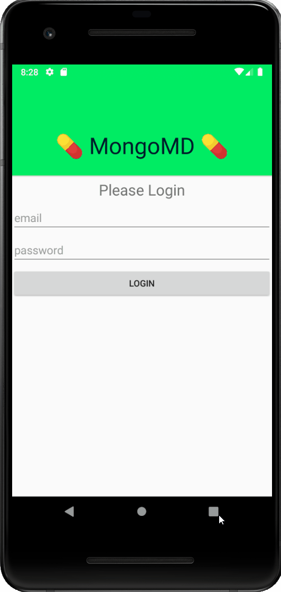
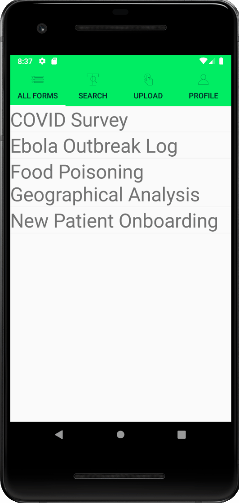
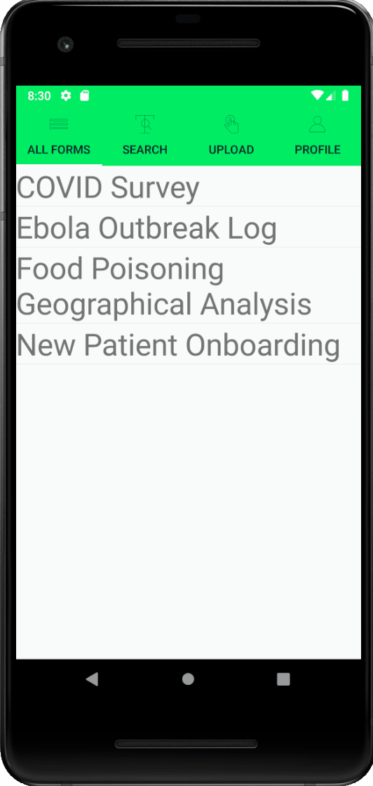
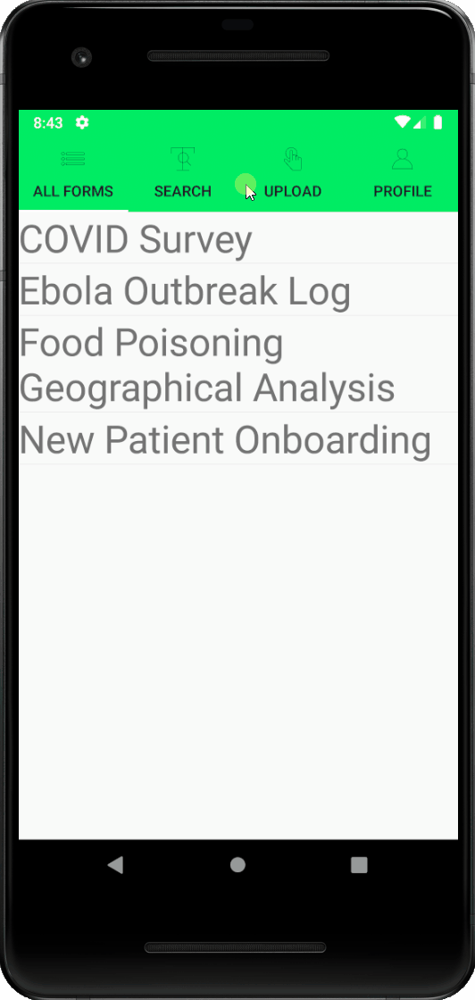
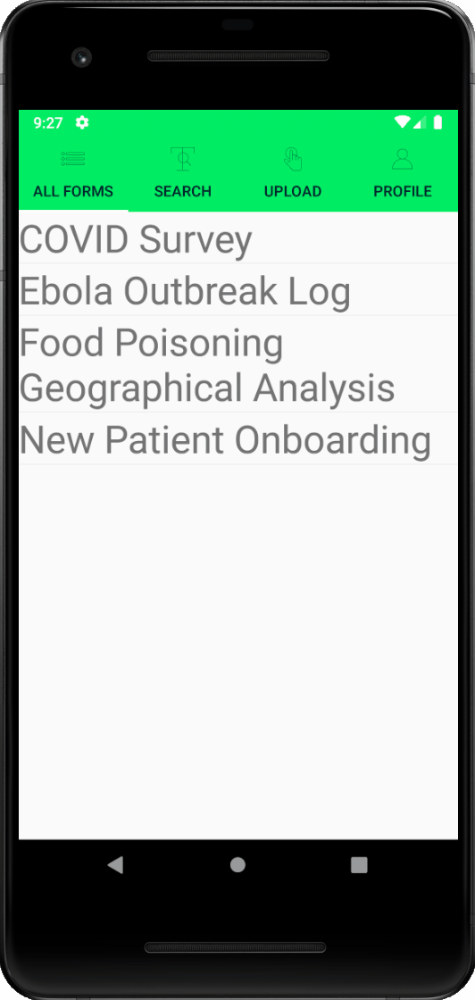
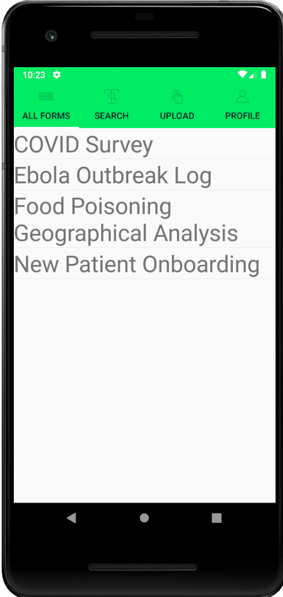

# MongoMD - Mobile
__Demonstrates Realm Sync. calling Realm Functions, offline support, and more through the use of a mobile app.__

__SA Maintainer__: [Chris Grabosky](mailto:chris.grabosky@mongodb.com)

__Time to setup__: 5 mins after pre-requisites 

__Time to execute__: 15 mins

## Prerequisites

* Visual Studio 2019 or later installed
* Xamarin support for Xamarin Forms and Android Development installed
* Cluster deployed, Realm app deployed, sample data deployed, and all other pre-reqs in main [README.md](../README.md)

## Setup

1. Open the Solution
2. Ensure the Realm app has username/password authentication enabled and you have a user
3. Edit  to change the Realm APP ID to that of your App
4. Run the project 

## Screenshots

