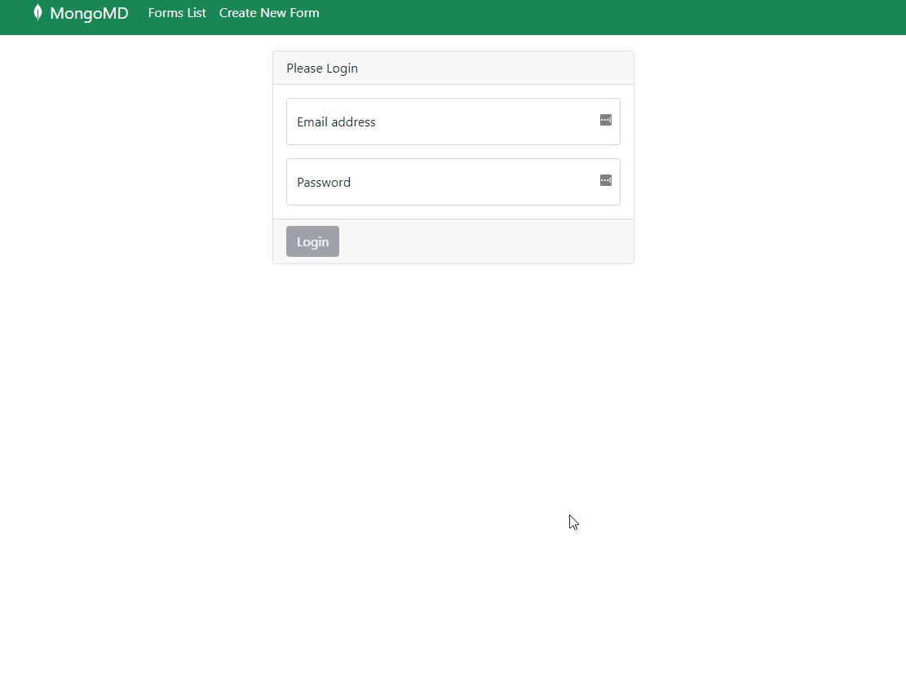
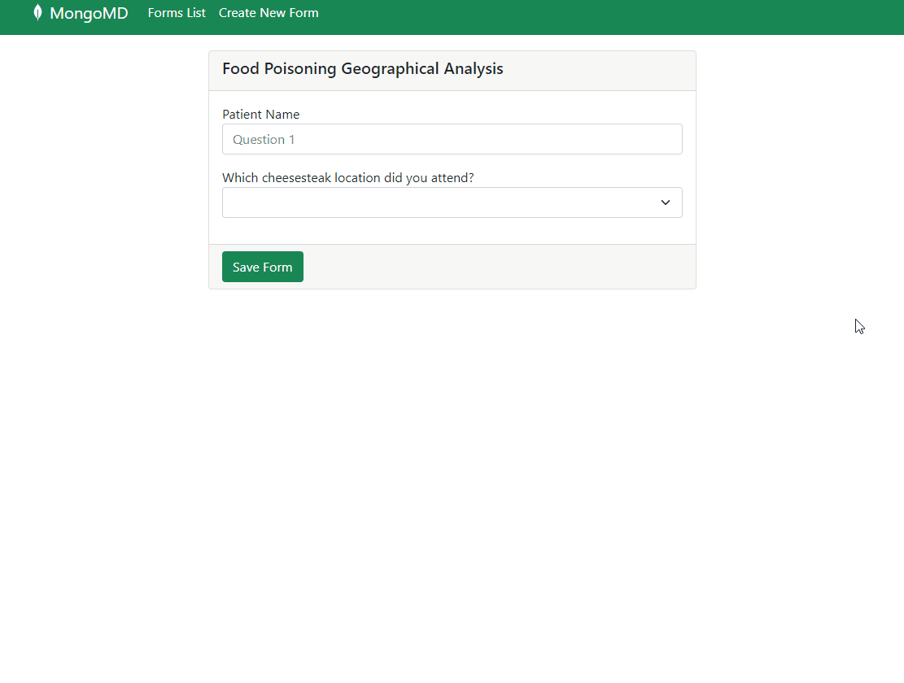
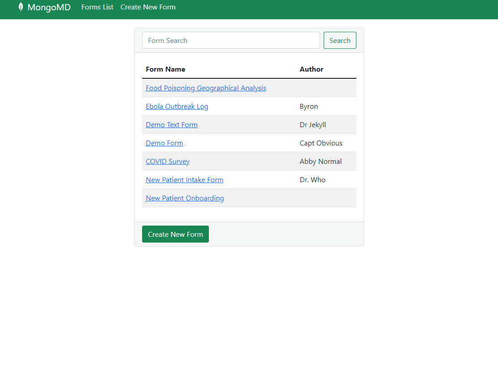
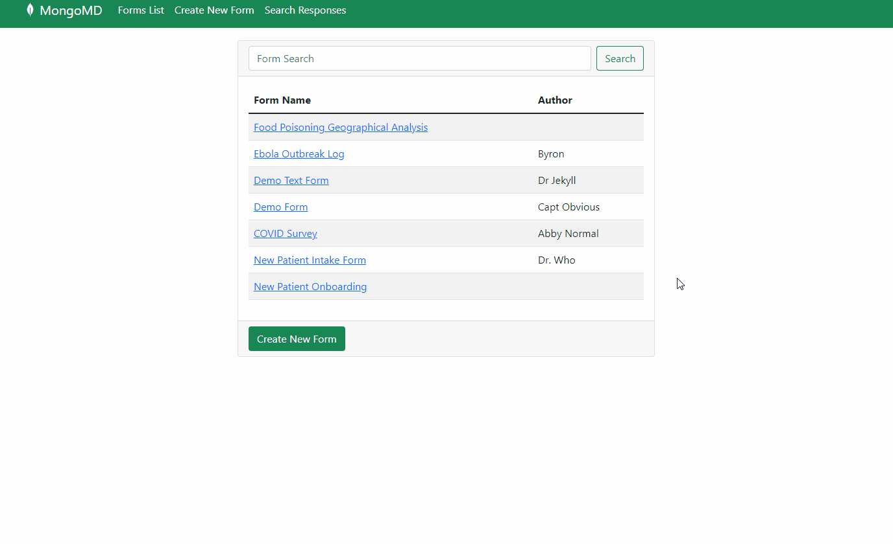

# MongoMD - Web
__Demonstrates the flexible schema attributes of MongoDB through the user defined forms in an Angular app runnign on Realm Web Services to simplify code and improve the developer experience.__

__SA Maintainer__: [Josh Smith](mailto:josh.smith@mongodb.com)

__Time to setup__: 30 mins

__Time to execute__: 15 mins

---

## Description

This proof demonstrates how to use Realm Web Services and the Realm Web SDK. It also demonstrates the power of the document data model by supporting a set of user defined forms and their associated data points. 

Originally intended to mimic the types of forms that a clinician might complete when a patient comes to a medical office for a visit, MongoMD allows for a rich set of fields to be defined via a JSON payload. Those are then rendered into a set of forms for the user to complete.  Those results are then searchable using Atlas Search and the facets associated. 

---
## Setup


1. Configure Atlas Environment
  Configuration of the Atlas Environment can be found here [Test Readme](../README.md)

2. Configure Laptop

    The MongoMD frontend is built using Angular and works best with the Angular CLI. Current versions of the app are running 
    * Angular 13.2.6
    * Typescript 4.5.2
  
    Recommend installing these tools via [homebrew](https://brew.sh/)

    ```
    brew install angular-cli
    ```

    If you have not already, clone the GIT repo found @ [mdb-fy23q1-hackathon-team3](https://github.com/graboskyc/mdb-fy23q1-hackathon-team3)
    
    ```
    git clone git@github.com:graboskyc/mdb-fy23q1-hackathon-team3.git
    ```

    Then navigate into the ``` Frontend ``` directory and execute ng build to create the necessary dependencies and download the needed npm packages

    ```
    cd Frontend
    ng build

    ```

3. Configure the App

    MongoMD needs to know the appId for your Realm application (setup in the earlier README). To configure MongoMD, you need to replace the place holder with your app key in the ``` src > environments ``` folder

    ```
    cd src/environments

    ```

    environment.ts & environment.prod.ts

    ```
    export const environment = {
    production: false,
    app_id: '<REPLACE ME>'
    };

    ```
    with 
    ```
    export const environment = {
    production: false,
    app_id: '<YOUR APP ID>'
    };

    ```


4. Running the App

    To start the app, you use the ``` ng serve ``` command to have angular-cli start up the server and run the code. By default the app will run @ http://localhost:4200


## Screenshots







