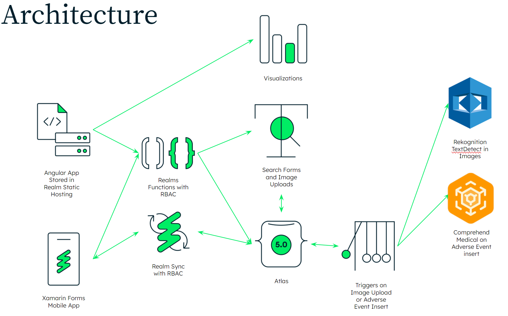

# Details

**Project** : MongoMD's FlexForm - Your EMR system providing digital transformation of paper forms

**Team Number** : 3 

**Team Name** : 💊 MongoMD 💊  

**Demonstration Video** : Available [here](https://youtu.be/iyHmzw-9q3E)

**Screenshot Deck**: Available [here](https://docs.google.com/presentation/d/1cBWPuhfAlomNBgNbKmXRzULkHmc9Fo-jiJVM987-B6Q/edit?usp=sharing)


# Overview

MongoMD is a modern tool to assist in modernizing health care and doctor-patient relationships. Using MongoDB, it provides a flexible data model to enter health surveys and other background information into either a web-based application or a mobile application (Android). This is automatically reported on and searchable all within one transactional database. Additionally within the mobile application paper forms can be scanned and uploaded which is then OCR/Analyzed. Lastly, data can be cross-referenced with medical databases for reliability.

# Justification

The inspiration of this app is from a real-world opportunity for legacy modernization in US-Central. It continues the work of vertical demos. Similar use cases in other verticals have also been noticed in New England / Canada and NY Metro.

This helps improve solutions consulting activities since it provides another vertical-focused end-to-end demo that solves real-world "what about" scenarios. For example, providing a web based computer interface is great, but the next question is often a followup of "my volunteers are in the field with bad internet access... what can you do for them" or after presenting the form discovery customers may ask "how can I find the data and responses once I have a large data set" or "how can I present data back out visually" or even "how can I correlate this data with other data sets" - here we have an end-to-end demo to showcase these scenarios.

In the end, it is all about demonstrating developer efficiency and MongoDB's tooling and flexible data model. After all, a multi-platform app was written from the ground up in two days. That is a perfect embodiment of increasing of developer efficiency.

# Detailed Application Overview
## What it does
This is meant to reduce the amount of paper in doctors offices, insurance companies, or even in the field. As a result, forms can be built dynamically, similar to Microsoft Infopath or Google Forms. Data types can be things like open text fields, checkboxes, drop down lists, etc. This is done via a modern Angular web app.

Once a form is created, it can be answered by doctors, nurses, or other field personnel in that web app or on a mobile Android device which is critically important for areas with bad cell reception.

Additionally, if a form needed to be done with paper, the form can be captured with the mobile app's camera and uploaded when cell signal is available. This is then analyzed for OCR.

## How it works



* Built on MongoDB Atlas 5.0
* All application logic is stored in Realm App Services functions
* The Web UI is hosted on Realm Static Hosting and written in Angular and calls those functions
* Those functions do basic CRUD as well as Search operations
* An Android app written using Realm Sync and the C#/Xamarin Forms SDK
* CRUD operations are done offline-first with Realm Mobile 
* Search operations call Realm Functions to execute the same Search functions as the Angular app
* The Android app can upload a base64 encoded image of paper forms
* Upon upload, Realm Triggers fire to have AWS Rekognition do TextDetect on the form
* MongoDB Charts can graph results and form data


# Roles and Responsibilities

* Nick Gogan - AWS Comprehend integration, Search, Enrichment, Charts
* Chris Grabosky - Realm App, Realm App Services Functions, Rekognition
* Mike Grayson - Document Model, Automation Scripts, Failover Testing
* Josh Smith - Angular Front End

# Demonstration Script

## Setup

### Laptop Setup
* Ensure Realm CLI is [installed](https://docs.mongodb.com/realm/deploy/realm-cli-reference/#installation), e.g.:

```bash
npm install -g mongodb-realm-cli
```
* Pull this repository
  
### Atlas Setup
* Deploy an Atlas cluster (M10 minimum)
* Create a Realm App

### Sample Data and Indexes
* Navigate to the setup folder in the pulled repository and run mongorestore to load the sample data.

```bash 
tar xvf sample_data.tar.gz  
mongorestore --uri=<connectionString for your Atlas Cluster> dump/
```

* After successfully loading the Sample Data, now we can create the Search Indexes, we'll need some information that the script asks for to be able to interact with the Atlas Search API to create the indexes.

```bash 
./create_indexes.sh
What is your Atlas API Public Key?
<Your Public Key>
What is your Atlas API Private Key?
<Your Private Key>
What is your Atlas PROJECT_ID?
<Project_ID>
What is your Atlas Cluster name?
Cluster0
```

* This should create 3 Search indexes that will help support the different search portions of the application.

### Charts
* TK


### Import Realm App

* Using the realm-cli you will need to import the Realm App

```bash 
realm-cli push --local "./Realm-App"
```

### Additional Prep
* Add yourself a Realm user using Email/Password authentication

### Optional Prep
* mLocust integration was done. The locust file can be found [here](mLocust/locustfile-faker.py)

### Web Frontend
* See walkthrough [here](Frontend/README.md)

### Mobile
* See walkthrough [here](FlexFormMobile/README.md)

### Teardown
* Delete Realm app
* Delete Chart Dashboards
* Delete Cluster

## Demonstration
When demonstrating 💊 MongoMD 💊  complete the following and add emphasis as outlined below:

* Choose this demo if any of the following RCs are applicable: 
  * Industry Vertical is health care / medical records
  * Use case is for dynamic form data
  * RCs include the flexible data model
  * RCs include serverless architectures
  * RCs include Realm Sync
  * RCs include enrichment / real time event-driven architectures  
* Begin by explaining what this application is as outlined in the Background so the customer isn't lost
* Start the demo with the web interface
  * Highlight this is all done in a serverless architecture and as a result is highly available
* Walk though the features as outlined in the 3 minute video above
  * Key features here are RBAC, authentication, and flexible data model
  * On the search and reporting pages highlight this is using Atlas Search and Charts and that one database is handling both transactional and analytical and Search workloads, increasing developer efficiency 
* Switch to demonstrating the mobile app as shown in the 3 minute video above
  * Highlight the power of offline-first 
  * Highlight sync without developers writing sync protocols 
  * Highlight serverless scale and shared data with RBAC
* Show the end-to-end architecture slide 
  * Highlight high availability
  * Highlight the developer efficiency of one data platform 
  * Highlight event-driven architecture with enrichment and data processing 
  * Highlight integration into native cloud services like Rekognition and Comprehend

# Scoring Rubric Highlights
## Mandatory
* MongoDB version 5.0
* Atlas Search (autocomplete index)

## Optional
* Realm Sync
* Charts
* Realm App Services (functions, auth)

## Bonus Points
* +3 - Real opportunity related
* +5 WOW - OCR upload of hand-written forms which is then searchable
* +5 WOW - That mad nice search / facet / charts page
* +2 RC - "Flexible Data Model is an excellent fit for this use case since Forms data can have multiple questions and each have a response"
* +2 RC - "Doctors offices do not always have the best internet connectivity, especially in rural and remote areas so offline-first applications are critical"
* +2 RC - "I want to be able to search and find my results and forms easily" 
* +2 RC - "I want to quickly report on the results"
* +5 Industry Vertical - Legacy Modernization of Health Care
* +3 mLocust - generated sample responses with mLocust
* +3 Cloud Integration - AWS Comprehend Medical integration
* +3 Cloud Integration - AWS Rekognition DetectText
* +10 Multi-Region: Business Continuity under a cloud region outage

## Core Values
* Build Together - built across the entire US in 2 days by only 4 people
* Make It Matter - this sort of data entry is a problem in rural and remote areas
* Be Intellectually Honest - we thought we would have gotten more done :( 
